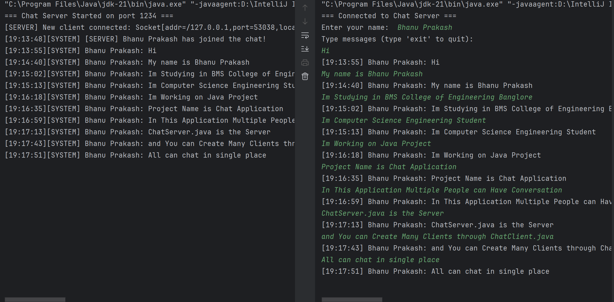

<h1 align="center"> JavaProject-Chat-App</h1>

  A simple yet powerful <b>real-time chat application</b> built in <b>Java</b>.  
  Stay connected with your friends, exchange messages instantly, and explore how networking in Java really works! 🚀

<h2>✨ Features</h2>
<ul>
  <li> Real-time messaging between multiple clients</li>
  <li> Easy-to-use graphical user interface (GUI)</li>
  <li> Secure communication using sockets</li>
  <li> Supports multiple users simultaneously</li>
  <li> Fast and lightweight</li>
</ul>

<h2>🛠️ Tech Stack</h2>
<ul>
  <li><b>Language:</b> Java</li>
</ul>

<h2>📂 Project Structure</h2>

<pre>
JavaProject-Chat-App/
── src/
   ├── client/
   │    └── ChatClient.java
        └── ClientListener.java
        └── ClientUtils.java
   ├── modules/
   │    └── Message.java
        └── User.java
   └── server/
   │     └── ChatServer.java
         └── ClientHandler.java
         └── ServerUtils.java
   └── services/
   │     └── ChatService.java
         └── FileTransferService.java
   └── utils/
        └── Constants.java
        └── LoggerUtil.java
</pre>

<h3>🔹 Running the Application</h3>
<ol>
  <li>Start the server:
    <pre><code>javac ChatServer.java
java ChatServer</code></pre>
  </li>
  <li>Run the client(s):
    <pre><code>javac ChatClient.java
java ChatClient</code></pre>
  </li>
  <li>Open multiple clients to simulate a group chat! 🎉</li>
</ol>

<h2>📸 Screenshots</h2>

  

<h2>✅ Conclusion</h2>

The <b>JavaProject-Chat-App</b> showcases the power of <b>Java networking</b> by enabling 
real-time communication between multiple users. With socket programming and a simple 
GUI, this project provides the foundation of a lightweight and interactive 
chat application.

